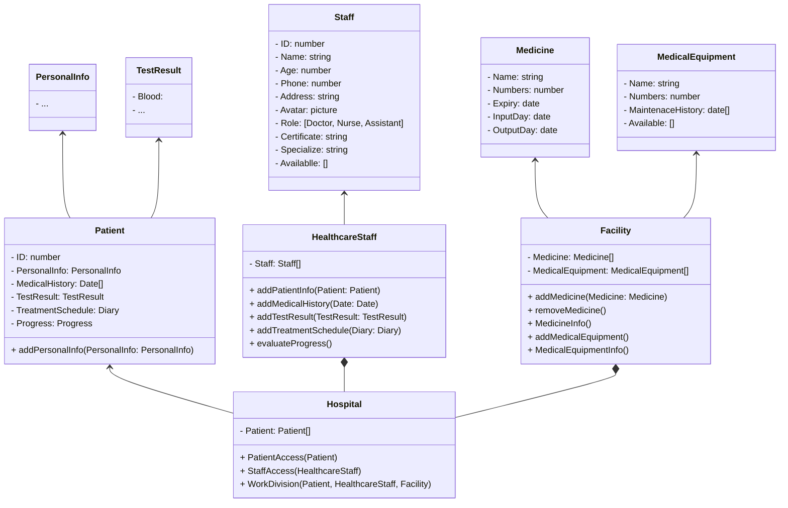

# Hospital Management System Using Django
This hospital management system is designed with the goal of not only being a tool to track and manage patient and medical staff information, but also a smart solution to help optimize work processes, ensuring patient care is delivered in the best and most effective way.

## UML

## Features of this Project

- ###  Admin Users Can
1. Manage Healthcare Staff (Add, Update, and Delete)
2. Manage Patient (Add, Update, and Delete)
3. Manage Facilities (Add, Update, and Delete)
4. View All Information about Patient, Healthcare Staff
5. Divide Work for Healthcare Staff
6. View Chart Analysis about Patient Recovery Progress, Facility Level Use, and Patient Satisfaction Level
    - Patient Recovery Progress: Percentage chart
    - Facility Level Use: Bar chart about number of each medicine used and number of times equipment used
    - Patient Satisfaction Level: Percentage chart
8. Review and Reply Patient/Healthcare Staff Feedback 
- ###  Healthcare Staff Can
1. Add/Update their Personal Information
2. See all about their Patient and Work Duty
3. Add/Update Patient Personal Information
4. Add/Update Patient Medical History
5. Add/Update Patient Test Result
6. Evaluate Patient Progress
7. View Patient Treatment Schedule
8. View Available Facility
9. Send Feedback to admin
- ### Patient Can
1. Add/Update their Personal Information
2. View Medical History
3. View Test Result
4. View Treatment Schedule
5. View Healthcare Staff Evaluation
6. Send Feedback about their satisfaction to admin

## How to Install and Edit this project?

### Pre-Requisites:
1. Install Git Version Control
[ https://git-scm.com/ ]

2. Install Python Latest Version
[ https://www.python.org/downloads/ ]

3. Install Pip (Package Manager)
[ https://pip.pypa.io/en/stable/installing/ ]


### Installation
**1. Create a Folder where you want to save the project**

**2. Create a Virtual Environment and Activate**

Install Virtual Environment First
```
pip install virtualenv
```

Create Virtual Environment

For Windows
```
python -m venv venv
```
For Mac
```
python3 -m venv venv
```
For Linux
```
virtualenv .
```

Activate Virtual Environment

For Windows
```
venv\Scripts\activate
```

For Mac
```
source venv/bin/activate
```

For Linux
```
source bin/activate
```

**3. Clone this project**
```
git clone https://github.com/AsunaYuuki197/hospital-management.git
```

Then, Enter the project
```
cd hospital-management
```

**4. Install Requirements from 'requirements.txt'**
```python
pip install -r requirements.txt
```

**5. Edit some File, Do some Work**

**6. Push to repo by this command line**

Add all file changed
```
git add . 
```

Commit it
```
git commit -m "summary work you have done"
```

Push it to repo
```
git push
```

