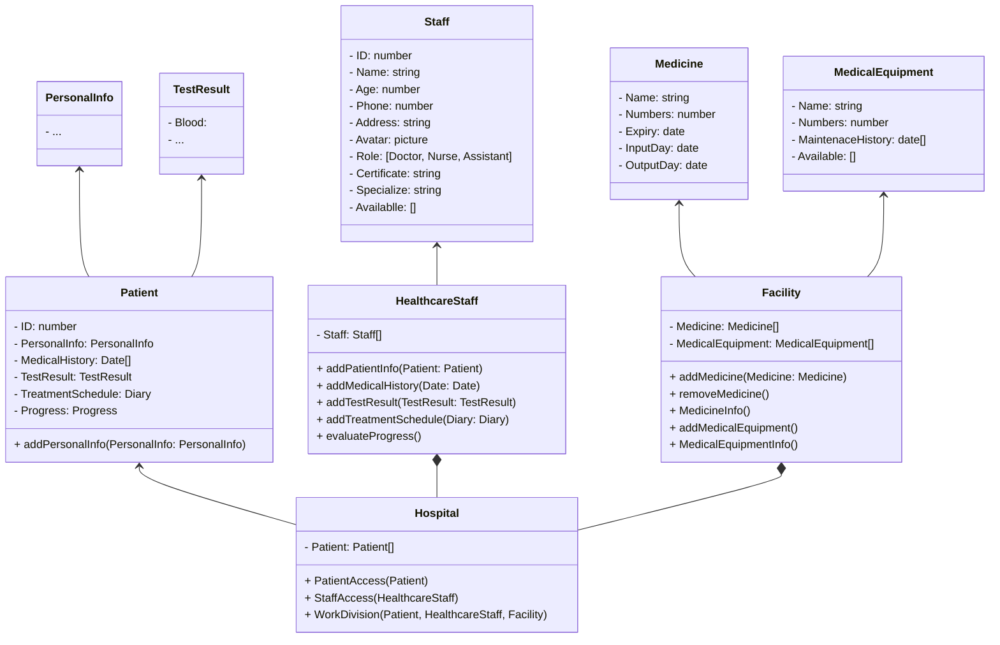

# Hospital Management System Using Django
This hospital management system is designed with the goal of not only being a tool to track and manage patient and medical staff information, but also a smart solution to help optimize work processes, ensuring patient care is delivered in the best and most effective way.

# UML

