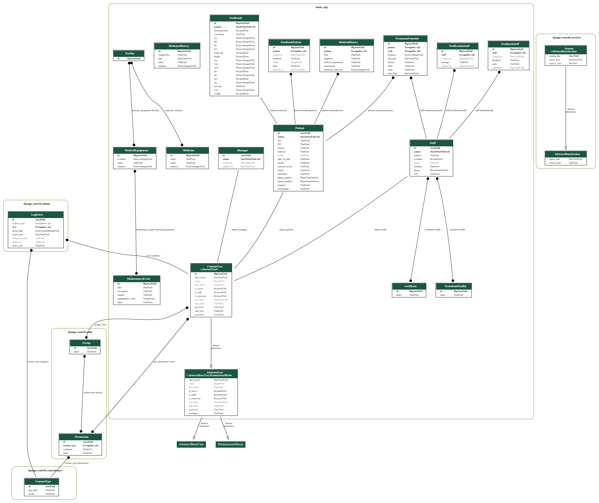
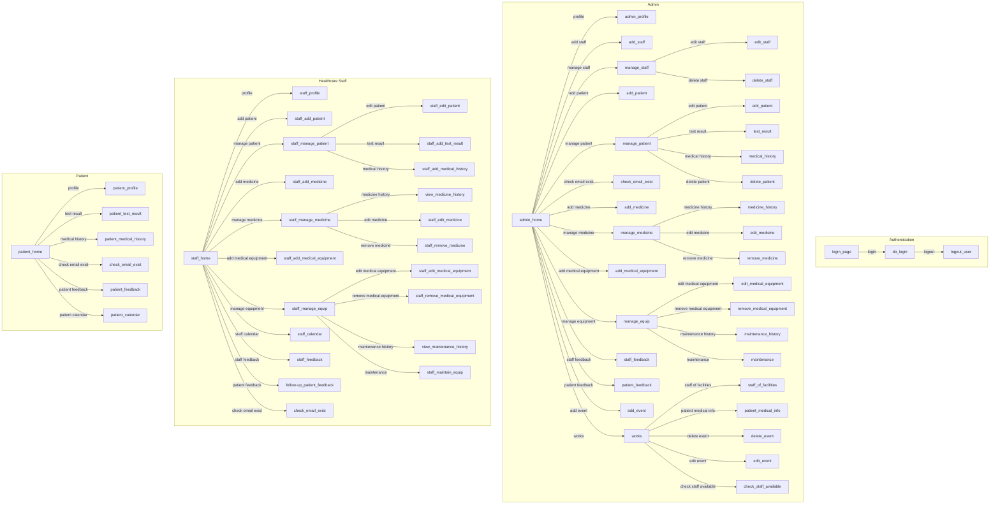

# Hospital Management System Using Django
This hospital management system is designed with the goal of not only being a tool to track and manage patient and medical staff information, but also a smart solution to help optimize work processes, ensuring patient care is delivered in the best and most effective way.

## Model Class Diagram
[](ModelClassDiagram.png)

## All Views and Paths Diagram


You can view more clearly in https://www.mermaidchart.com/raw/0de699b0-df2e-447a-b6e5-0a4ad195f903?theme=light&version=v0.1&format=svg

## Features of this Project

- ###  Admin Users Can
1. Manage Healthcare Staff (Add, Update, and Delete)
2. Manage Patient (Add, Update, and Delete)
3. Manage Facilities Medicine and Medical Equipment (Add, Update, and Delete)
4. View All Information about Patient, Healthcare Staff
5. Divide Work for Healthcare Staff
6. View Overall Chart Analysis about hospital 
7. Review and Reply Patient/Healthcare Staff Feedback 
- ###  Healthcare Staff Can
1. Update their Personal Information
2. See all about their Patient and Work Duty
3. Add/Update Patient Personal Information
4. Add/Update Patient Medical History
5. Add/Update Patient Test Result
6. View Patient Treatment Schedule
7. View Available Facility
8. Send Feedback to admin
9. Review and Reply Patient
- ### Patient Can
1. Update their Personal Information
2. View Medical History
3. View Test Result
4. View Treatment Schedule
5. Send Feedback about their satisfaction/feedback to admin and staff

## How to Install and Run this project?

### Pre-Requisites:
1. Install Git Version Control
[ https://git-scm.com/ ]

2. Install Python Latest Version
[ https://www.python.org/downloads/ ]

3. Install Pip (Package Manager)
[ https://pip.pypa.io/en/stable/installing/ ]


### Installation
**1. Create a Folder where you want to save the project**

**2. Create a Virtual Environment and Activate**

Install Virtual Environment First
```
pip install virtualenv
```

Create Virtual Environment

For Windows
```
python -m venv venv
```
For Mac
```
python3 -m venv venv
```
For Linux
```
virtualenv .
```

Activate Virtual Environment

For Windows
```
venv\Scripts\activate
```

For Mac
```
source venv/bin/activate
```

For Linux
```
source bin/activate
```

**3. Clone this project**
```
git clone https://github.com/AsunaYuuki197/hospital-management.git
```

Then, Enter the project
```
cd hospital-management
```

**4. Install Requirements from 'requirements.txt'**
```python
pip install -r requirements.txt
```

**5. Add the hosts**

- Got to settings.py file 
- Then, On allowed hosts, Use **[]** as your host. 
```python
ALLOWED_HOSTS = []
```
*Do not use the fault allowed settings in this repo. It has security risk!*


**6. Now Run Server**

Command for PC:
```python
$ python manage.py runserver
```

Command for Mac:
```python
$ python3 manage.py runserver
```

Command for Linux:
```python
$ python3 manage.py runserver
```

**7. Login Credentials**

Create Super User (Manager/Admin)

Command for PC:
```
$  python manage.py createsuperuser
```

Command for Mac:
```
$  python3 manage.py createsuperuser
```

Command for Linux:
```
$  python3 manage.py createsuperuser
```


Then Add Email and Password

**or Use Default Credentials**

*For Admin/Manager*
Email: admin@gmail.com
Password: hospitalmanager

*For Staff*
Email: staff@gmail.com
Password: hospitalstaff

*For Patient*
Email: patient@gmail.com
Password: hospitalpatient


### Connect to Azure Database for PostgreSQL

**1. Create account and login to https://portal.azure.com/.**

**2. Check this https://learn.microsoft.com/en-us/azure/postgresql/flexible-server/quickstart-create-server-portal to create a postgreSQL database in Azure.**

**3. Change DATABASES in Django Settings to PostgreSQL**
```
DATABASES = {
    'default': {
        'ENGINE': 'django.db.backends.postgresql',
        'NAME': os.getenv('DBNAME'),
        'HOST': os.getenv('DBHOST'),
        'USER': os.getenv('DBUSER'),
        'PASSWORD': os.getenv('DBPASS'),
        'PORT': '5432',
        "OPTIONS": {"sslmode": "require"},
        'CONN_MAX_AGE': None,
    }
}
``` 

You can use ```os.getenv()``` to take database Name, Host, User, Pass from your environment for security.

About database connection information, you can get it in Azure Portal by this instruction [https://learn.microsoft.com/en-us/azure/postgresql/flexible-server/connect-python]


### Connect to Firebase Storage or Google Cloud Storage

**1. Install Django API for Google Cloud**

```
pip install django-storages[google]
```

**2. Get the Google Service Account**

We use Firebase and reason right after this instruction.

- Create a Firebase and Register your web app [https://firebase.google.com/docs/web/setup?continue=https%3A%2F%2Ffirebase.google.com%2Flearn%2Fpathways%2Ffirebase-web%23article-https%3A%2F%2Ffirebase.google.com%2Fdocs%2Fweb%2Fsetup#create-firebase-project-and-app]

- Go to Storage options in Firebase and Get started

- Generate a private key file for your service account [https://firebase.google.com/docs/admin/setup#initialize_the_sdk_in_non-google_environments]


First of all, Firebase is easy to use and doesn't need to satisfy some requirements like Google Cloud. "Firebase Cloud Storage also stores your data in Google Cloud Storage bucket. The Firebase Admin SDK allows you to directly access your Cloud Storage buckets from privileged environments. Then you can use Google Cloud Storage APIs to manipulate the objects stored in the buckets."[https://firebase.google.com/docs/storage/admin/start]

Therefore, we can still treat it like the Google Cloud Storage which can use by Django File API, even Django doesn't support Firebase directly. 

**3. Load Firebase credentials from service account**

```
from google.oauth2 import service_account
firebase_credentials_path = os.path.join(BASE_DIR, 'serviceAccountKey.json')
firebase_cred = service_account.Credentials.from_service_account_file(firebase_credentials_path)
```

**5. Change your 'default' STORAGES in settings**
```
STORAGES = {
    'default':{
        "BACKEND": "storages.backends.gcloud.GoogleCloudStorage",
        "OPTIONS": {
            "bucket_name": 'your_bucket_name',
            "credentials": firebase_cred,
            "default_acl": 'publicRead',
        }        
    },
    ...
}
```

Your bucket name is 'storageBucket' value in Firebase JS SDK in project settings. To get data, especially images, we can use the following link. [https://storage.googleapis.com/ + storageBucket + path/to/yourfile]. Last thing is manage your file in Google Cloud Storage bucket instead. 

## Contribute

**1. Edit some File, Do some Work**

**2. Push to repo by this command line**

Add all file changed
```
git add . 
```

Commit it
```
git commit -m "summary work you have done"
```

Push it to repo
```
git push
```

<!-- **3. Resolve Conflict (repo has commits, and local has commit too)**

Add all file changed
```
git add . 
```

Commit it
```
git commit -m "summary work you have done"
```

Push it to repo
```
git push
```

Cant push, because in repo has changes
```
git pull
```

If it appears tool for choose current changes or incoming change, then use it, but carefull
```
There has something like merge tool in file has changes conflict, you should take option accept both changes, then. 
git add .
git commit -m "add story"
git pull (optional)
git push
```


If it doesnt appears tool, and it looks strange, you can do this
```
git add .
git commit -m "add story"
git pull
git push
``` -->

