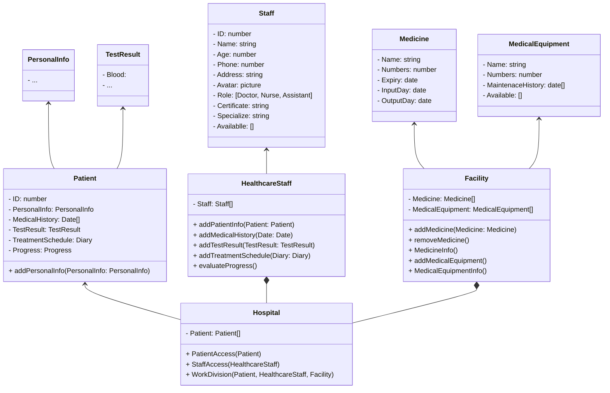

# Hospital Management System Using Django
This hospital management system is designed with the goal of not only being a tool to track and manage patient and medical staff information, but also a smart solution to help optimize work processes, ensuring patient care is delivered in the best and most effective way.

## UML

## Features of this Project

### Admin Users Can
1. 
### Healthcare Staff Can
1. 
### Patient Can
1. 

## How to Install and Run this project?

### Pre-Requisites:
1. Install Git Version Control
[ https://git-scm.com/ ]

2. Install Python Latest Version
[ https://www.python.org/downloads/ ]

3. Install Pip (Package Manager)
[ https://pip.pypa.io/en/stable/installing/ ]


### Installation
**1. Create a Folder where you want to save the project**

**2. Create a Virtual Environment and Activate**

Install Virtual Environment First
```
pip install virtualenv
```

Create Virtual Environment

For Windows
```
python -m venv venv
```
For Mac
```
python3 -m venv venv
```
For Linux
```
virtualenv .
```

Activate Virtual Environment

For Windows
```
source venv/scripts/activate
```

For Mac
```
source venv/bin/activate
```

For Linux
```
source bin/activate
```

**3. Clone this project**
```
git clone https://github.com/AsunaYuuki197/hospital-management.git
```

Then, Enter the project
```
cd student-management
```

**4. Install Requirements from 'requirements.txt'**
```python
pip install -r requirements.txt
```


