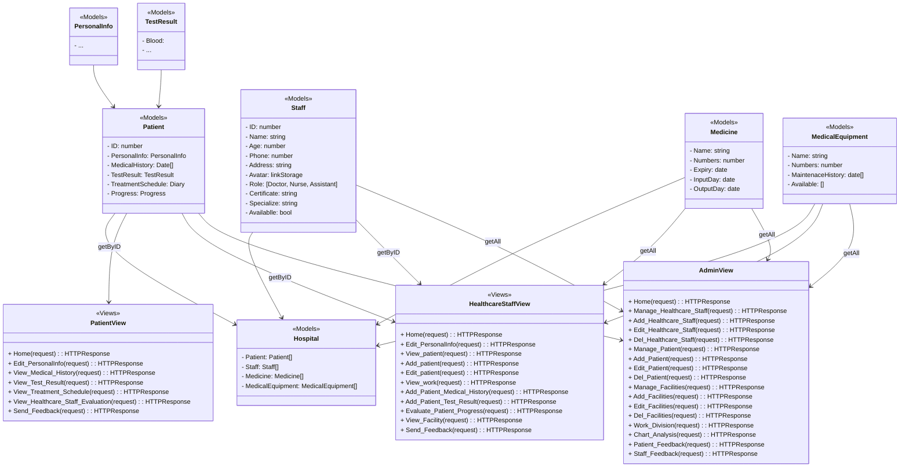

# Hospital Management System Using Django
This hospital management system is designed with the goal of not only being a tool to track and manage patient and medical staff information, but also a smart solution to help optimize work processes, ensuring patient care is delivered in the best and most effective way.

## MODEL CLASS DIAGRAM
[](ModelClassDiagram.png)


## Features of this Project

- ###  Admin Users Can
1. Manage Healthcare Staff (Add, Update, and Delete)
2. Manage Patient (Add, Update, and Delete)
3. Manage Facilities Medicine and Medical Equipment (Add, Update, and Delete)
4. View All Information about Patient, Healthcare Staff
5. Divide Work for Healthcare Staff
6. View Overall Chart Analysis about hospital 
7. Review and Reply Patient/Healthcare Staff Feedback 
- ###  Healthcare Staff Can
1. Update their Personal Information
2. See all about their Patient and Work Duty
3. Add/Update Patient Personal Information
4. Add/Update Patient Medical History
5. Add/Update Patient Test Result
6. View Patient Treatment Schedule
7. View Available Facility
8. Send Feedback to admin
9. Review and Reply Patient
- ### Patient Can
1. Update their Personal Information
2. View Medical History
3. View Test Result
4. View Treatment Schedule
5. Send Feedback about their satisfaction/feedback to admin and staff

## How to Install and Edit this project?

### Pre-Requisites:
1. Install Git Version Control
[ https://git-scm.com/ ]

2. Install Python Latest Version
[ https://www.python.org/downloads/ ]

3. Install Pip (Package Manager)
[ https://pip.pypa.io/en/stable/installing/ ]


### Installation
**1. Create a Folder where you want to save the project**

**2. Create a Virtual Environment and Activate**

Install Virtual Environment First
```
pip install virtualenv
```

Create Virtual Environment

For Windows
```
python -m venv venv
```
For Mac
```
python3 -m venv venv
```
For Linux
```
virtualenv .
```

Activate Virtual Environment

For Windows
```
venv\Scripts\activate
```

For Mac
```
source venv/bin/activate
```

For Linux
```
source bin/activate
```

**3. Clone this project**
```
git clone https://github.com/AsunaYuuki197/hospital-management.git
```

Then, Enter the project
```
cd hospital-management
```

**4. Install Requirements from 'requirements.txt'**
```python
pip install -r requirements.txt
```

**5. Add the hosts**

- Got to settings.py file 
- Then, On allowed hosts, Use **[]** as your host. 
```python
ALLOWED_HOSTS = []
```
*Do not use the fault allowed settings in this repo. It has security risk!*


**6. Now Run Server**

Command for PC:
```python
$ python manage.py runserver
```

Command for Mac:
```python
$ python3 manage.py runserver
```

Command for Linux:
```python
$ python3 manage.py runserver
```

**7. Login Credentials**

Create Super User (Manager/Admin)

Command for PC:
```
$  python manage.py createsuperuser
```

Command for Mac:
```
$  python3 manage.py createsuperuser
```

Command for Linux:
```
$  python3 manage.py createsuperuser
```


Then Add Email and Password

**or Use Default Credentials**

*For Admin/Manager*
Email: admin@admin.com
Password: hospitaladmin

*For Staff*
Email: staff@staff.com
Password: hospitalstaff

*For Patient*
Email: patient@student.com
Password: hospitalpatient


### Contribute

**1. Edit some File, Do some Work**

**2. Push to repo by this command line**

Add all file changed
```
git add . 
```

Commit it
```
git commit -m "summary work you have done"
```

Push it to repo
```
git push
```

**3. Resolve Conflict (repo has commits, and local has commit too)**

Add all file changed
```
git add . 
```

Commit it
```
git commit -m "summary work you have done"
```

Push it to repo
```
git push
```

Cant push, because in repo has changes
```
git pull
```

If it appears tool for choose current changes or incoming change, then use it, but carefull
```
There has something like merge tool in file has changes conflict, you should take option accept both changes, then. 
git add .
git commit -m "add story"
git pull (optional)
git push
```


If it doesnt appears tool, and it looks strange, you can do this
```
git add .
git commit -m "add story"
git pull
git push
```

